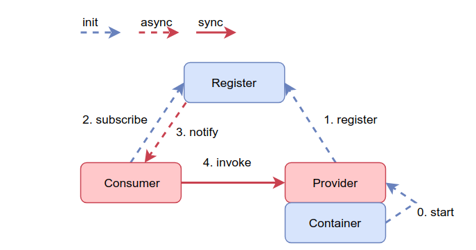

# Kirin RPC

一款玩票性质的RPC框架。



## 特性

- 基于Netty4的RPC服务器
  - 心跳机制
  - 重连机制
- Zookeeper注册中心
- 序列化工具protostuff
- 支持异步调用和同步调用
- 两种集群容错机制
  - Fail Fast : 快速失败
  - Fail Over : 失败自动切换
- 负载均衡机制
  - RandomLoadBalance : 基于权重随机算法
- 面向注解，面向Spring Boot

**想了解关于框架机制的老哥可以参考[wiki](https://github.com/nnkwrik/KirinRPC/wiki/%E5%90%AF%E5%8A%A8%E8%BF%87%E7%A8%8B)**

## 简单示例

### Provider

启动类配置：

```java
@SpringBootApplication
@KirinProvider(name = "kirin-provider",
        registryAddress = "127.0.0.1:2181",
        providerAddress = "127.0.0.1",
        providerPort = 7070)
public class ProviderAnnotationConfigApplication {
    public static void main(String[] args) {
        SpringApplication.run(ProviderAnnotationConfigApplication.class, args);
    }
}
```

编写要提供的服务：

```java
@KirinProvideService(group = "group1")
public class EchoServiceImpl implements EchoService {
    public String echo(String words) {
        return words;
    }
}
```

### Consumer

启动类配置：

```java
@SpringBootApplication
@KirinConsumer(name = "kirin-consumer", registryAddress = "127.0.0.1:2181")
public class ConsumerAnnotationConfigApplication {
    public static void main(String[] args) {
        SpringApplication.run(ConsumerAnnotationConfigApplication.class, args);
    }
}
```

注入远程服务的bean：

```java
@Component
public class ConsumerController {
    //用法类似@Autowired
    @KirinConsumeService(group = "group1")
    private EchoService echoService;

    public String testEcho() {
        return echoService.echo("test");
    }
}
```

## 配置示例

除了在启动类上进行注解配置之外，也支持在resource/application.yml(.properties)下进行配置。这种配置方式比通过注解配置的配置方式优先级要高。

### Provider

```yaml
kirin:
  provider:
    enable: true
    name: kirin-provider2
    registry-address: 127.0.0.1:2181
    provider-address: 127.0.0.1
    provider-port: 7071
```

### Consumer

```yaml
kirin:
  consumer:
    enable: true
    name: kirin-consumer2
    registry-address: 127.0.0.1:2181
```

## 性能测试

下面是在本机进行测试的结果，使用的机器：

```
Intel® Core™ i5-8250U CPU @ 1.60GHz × 8
```

同步调用：

```
[SyncInvoke Benchmark] Request count: 25600000, time: 380 second, qps: 67368
```

异步调用：

```
[AsyncInvoke Benchmark] Request count: 1024000, time: 12 second, qps: 85333
```

